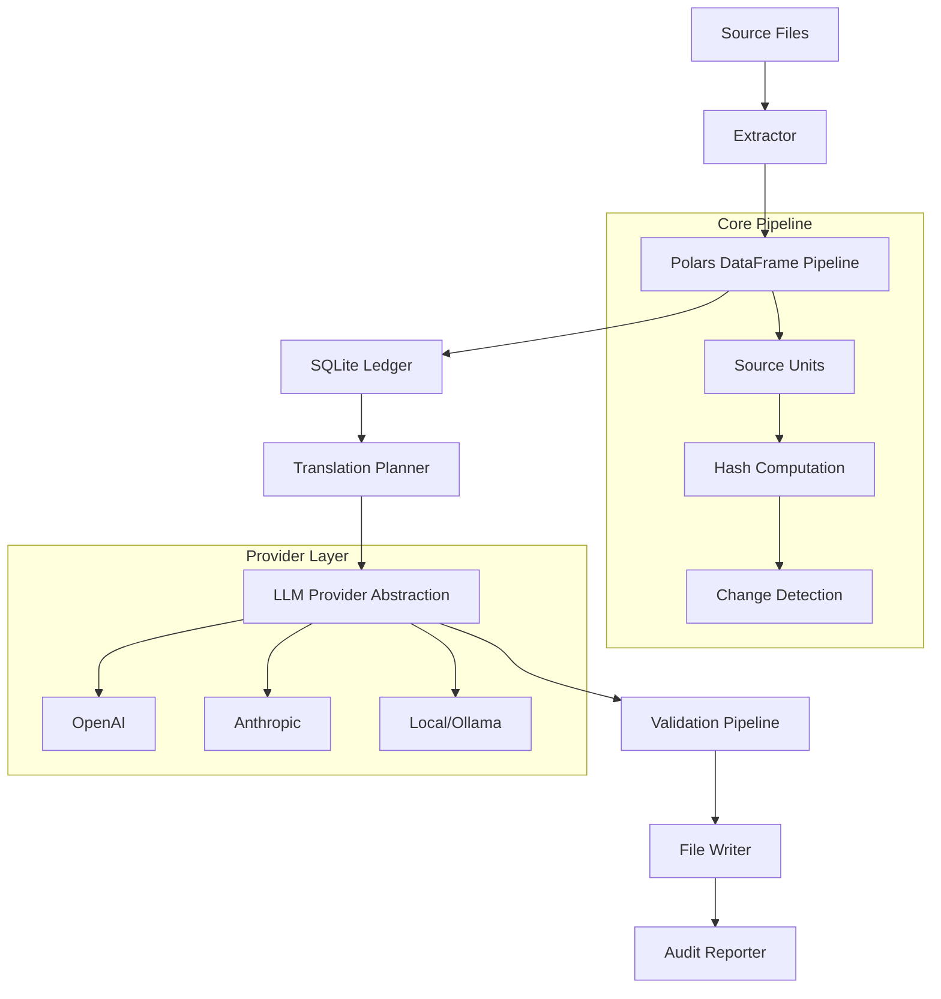

# Design Document: translatronx CLI

## Overview

translatronx is a deterministic, incremental, build-time translation compiler that leverages Large Language Models (LLMs) to translate application strings. The system treats localization as a pure compile step, providing zero runtime overhead while maintaining cost efficiency through incremental processing and developer override protection.

The architecture follows a pipeline pattern with clear separation of concerns: extraction → normalization → change detection → translation planning → LLM processing → validation → atomic file operations. Each stage is designed for reliability, performance, and maintainability.

## Architecture

### High-Level System Flow



### Component Architecture

The system is organized into distinct layers with clear interfaces:

1. **CLI Layer**: Command parsing, configuration loading, orchestration
2. **Pipeline Layer**: Data processing using Polars DataFrames
3. **State Layer**: SQLite-based persistence and change tracking
4. **Provider Layer**: LLM service abstraction and communication
5. **Validation Layer**: Multi-stage translation quality assurance
6. **File System Layer**: Atomic operations and integrity guarantees

## Components and Interfaces

### Core Pipeline Components

#### Extractor Interface
```typescript
interface Extractor {
  extract(sourceFiles: string[], config: ExtractorConfig): Promise<SourceUnit[]>
}

interface SourceUnit {
  unitId: string
  keyPath: string
  sourceText: string
  sourceHash: string
  context?: string
  placeholders: string[]
  sourceFile: string
  schemaVersion: number
}
```

The extractor component identifies and extracts translatable strings from source files. It supports pluggable extractors for different file formats (JSON, TypeScript, custom formats) and normalizes them into a consistent SourceUnit format.

#### Translation Planner
```typescript
interface TranslationPlanner {
  createPlan(sourceUnits: SourceUnit[], targetLanguages: string[]): Promise<TranslationPlan>
}

interface TranslationPlan {
  batches: TranslationBatch[]
  totalUnits: number
  estimatedCost: number
}

interface TranslationBatch {
  batchId: string
  sourceUnits: SourceUnit[]
  targetLanguage: string
  deduplicationKey: string
}
```

The planner analyzes source units against the current ledger state to determine what needs translation. It performs deduplication to minimize LLM costs by grouping identical strings with similar contexts.

#### LLM Provider Abstraction
```typescript
interface LLMProvider {
  translate(batch: TranslationBatch, prompt: PromptTemplate): Promise<TranslationResult[]>
  getModelFingerprint(): string
  estimateCost(batch: TranslationBatch): number
}

interface TranslationResult {
  unitId: string
  translatedText: string
  confidence?: number
  rawResponse?: any
}
```

The provider abstraction enables support for multiple LLM services through a unified interface. Each provider implements retry logic, rate limiting, and error handling specific to their service characteristics.

### State Management Components

#### SQLite Ledger Schema
```sql
-- Optimized schema for fast lookups and minimal storage
CREATE TABLE source_hashes (
    key_path TEXT PRIMARY KEY,
    value_hash TEXT NOT NULL,
    context_sig TEXT,
    last_seen_run TEXT,
    updated_at TIMESTAMP DEFAULT CURRENT_TIMESTAMP,
    INDEX idx_hash_lookup (value_hash, context_sig)
);

CREATE TABLE sync_status (
    key_path TEXT,
    lang_code TEXT,
    target_hash TEXT,
    status TEXT CHECK(status IN ('CLEAN','DIRTY','FAILED','MANUAL','SKIPPED')),
    model_fingerprint TEXT,
    prompt_version INTEGER,
    updated_at TIMESTAMP DEFAULT CURRENT_TIMESTAMP,
    PRIMARY KEY (key_path, lang_code),
    INDEX idx_status_lookup (status, lang_code)
);

CREATE TABLE run_history (
    run_id TEXT PRIMARY KEY,
    started_at TIMESTAMP,
    finished_at TIMESTAMP,
    model_used TEXT,
    tokens_in INTEGER,
    tokens_out INTEGER,
    cost_estimate_usd REAL,
    config_hash TEXT
);
```

The ledger uses optimized indexes for fast change detection and status queries. Content hashes enable efficient comparison without storing actual translation text, maintaining privacy and reducing storage requirements.

### Data Processing Pipeline

#### Polars DataFrame Schemas
The system uses Polars DataFrames for efficient data processing throughout the pipeline:

**Source Units DataFrame**:
- `unit_id`: Unique identifier for each translatable unit
- `key_path`: Hierarchical key path (e.g., "auth.login.button")
- `source_text`: Original text to translate
- `source_hash`: SHA-256 hash for change detection
- `context`: Additional context for translation quality
- `placeholders`: Array of placeholder patterns
- `source_file`: Origin file path
- `schema_version`: Version for backward compatibility

**Translation Plan DataFrame**:
- `unit_id`: Reference to source unit
- `lang_code`: Target language code
- `batch_id`: Grouping for LLM efficiency
- `priority`: Processing priority (1=high, 3=low)
- `reason`: Why translation is needed ("NEW", "MODIFIED", "RETRY")

**Results DataFrame**:
- `unit_id`: Reference to source unit
- `lang_code`: Target language
- `translated_text`: LLM output
- `target_hash`: Hash of translated content
- `validation_status`: Quality check results

### Validation Pipeline

#### Multi-Stage Validation
```typescript
interface ValidationPipeline {
  validate(result: TranslationResult, sourceUnit: SourceUnit): Promise<ValidationResult>
}

interface ValidationResult {
  isValid: boolean
  errors: ValidationError[]
  warnings: ValidationWarning[]
  confidence: number
}
```

The validation pipeline implements multiple stages:

1. **Structural Validation**: Zod schema compliance, required fields
2. **Placeholder Preservation**: Exact placeholder matching with configurable rules
3. **Semantic Validation**: Length checks, source leakage detection, empty string prevention
4. **Quality Assurance**: Optional brand name protection, HTML tag preservation

Each stage can trigger retries with modified parameters or escalate to fallback providers.

## Data Models

### Configuration Model
```typescript
interface translatronxConfig {
  sourceLanguage: string
  targetLanguages: string[]
  extractors: ExtractorConfig[]
  providers: ProviderConfig[]
  validation: ValidationConfig
  output: OutputConfig
  advanced?: AdvancedConfig
}

interface ProviderConfig {
  name: string
  type: 'openai' | 'anthropic' | 'groq' | 'local'
  apiKey?: string
  baseUrl?: string
  model: string
  temperature?: number
  maxRetries?: number
  fallback?: string
}
```

Configuration uses Zod for runtime validation and TypeScript for compile-time safety. The schema supports provider chaining for fallback scenarios and extensive customization options.

### File System Model
```typescript
interface FileOperation {
  type: 'read' | 'write' | 'merge'
  filePath: string
  content?: any
  backup?: boolean
}

interface AtomicWriter {
  writeTranslations(filePath: string, translations: Record<string, string>): Promise<void>
}
```

File operations use atomic writes (temp file + rename) to prevent corruption. The system supports deep merging to preserve existing translations not being updated.

## Correctness Properties

*A property is a characteristic or behavior that should hold true across all valid executions of a system—essentially, a formal statement about what the system should do. Properties serve as the bridge between human-readable specifications and machine-verifiable correctness guarantees.*

Before writing correctness properties, I need to analyze the acceptance criteria from the requirements document:

<function_calls>
<invoke name="prework">
<parameter name="featureName">translatronx-cli

After reviewing all the acceptance criteria, I need to perform property reflection to eliminate redundancy and combine related properties:

**Property Reflection Analysis:**
- Properties 1.1-1.6 cover the core translation pipeline and can be consolidated into fewer, more comprehensive properties
- Properties 2.1-2.5 all relate to incremental processing and can be combined
- Properties 3.1-3.5 all relate to manual override handling and can be consolidated
- Properties 4.1-4.5 cover provider abstraction and can be streamlined
- Properties 5.1-5.5 cover validation pipeline and can be combined
- Properties 6.1-6.5 cover file operations and can be consolidated
- Properties 7.1-7.5 cover configuration management and can be combined
- Properties 8.1-8.5 cover CLI commands and should remain separate as they test different behaviors
- Properties 9.1-9.5 cover ledger operations and can be consolidated
- Properties 10.1-10.5 cover audit/reporting and can be combined

Based on this analysis, here are the consolidated correctness properties:

### Property 1: Source Extraction and Hash Consistency
*For any* valid source file, extracting translatable strings should produce Source_Units with deterministic content hashes, where identical content always produces identical hashes and different content produces different hashes.
**Validates: Requirements 1.1, 1.2**

### Property 2: Incremental Processing Correctness
*For any* set of source units and existing ledger state, the translation plan should include exactly those units that have changed (new, modified, or failed) since the last successful run, and when no changes exist, no LLM calls should be made.
**Validates: Requirements 1.3, 2.1, 2.2, 2.3, 2.5**

### Property 3: Manual Override Protection
*For any* translation marked as Manual_Override, the system should preserve it from automatic regeneration unless the force flag is explicitly set, and override status should be correctly detected via hash mismatch and persisted across runs.
**Validates: Requirements 3.1, 3.2, 3.3, 3.4, 3.5**

### Property 4: Provider Abstraction Integrity
*For any* configured LLM provider, translation requests should go through the proper provider interface, maintain state when switching providers, and record provider fingerprints for audit purposes, with optional fallback behavior when providers fail.
**Validates: Requirements 1.4, 4.1, 4.2, 4.3, 4.4, 4.5**

### Property 5: Translation Validation Pipeline
*For any* translation result, the validation pipeline should correctly verify structural correctness, preserve all source placeholders, detect semantic issues (leakage, length), and either approve valid translations or trigger appropriate retry/failure handling.
**Validates: Requirements 1.5, 5.1, 5.2, 5.3, 5.4, 5.5**

### Property 6: Atomic File Operations
*For any* file write operation, the system should read current content, preserve existing translations not being updated, use atomic operations (temp + rename), maintain state consistency on failures, and update the ledger transactionally on success.
**Validates: Requirements 1.6, 6.1, 6.2, 6.3, 6.4, 6.5**

### Property 7: Configuration Management
*For any* configuration file, the system should load and validate it using Zod schemas, report specific errors for invalid configurations, detect changes appropriately, and apply all configured settings during execution.
**Validates: Requirements 7.1, 7.2, 7.3, 7.4, 7.5**

### Property 8: CLI Command Behavior - Sync
*For any* sync command execution, the system should perform incremental translation processing according to the current configuration and ledger state.
**Validates: Requirements 8.1**

### Property 9: CLI Command Behavior - Init
*For any* init command execution, the system should scaffold the expected configuration files and directory structure.
**Validates: Requirements 8.2**

### Property 10: CLI Command Behavior - Status
*For any* status command execution, the system should display coverage statistics and system state that accurately reflect the current ledger and file system state.
**Validates: Requirements 8.3**

### Property 11: CLI Command Behavior - Check
*For any* check command execution, the system should validate all target files without making any modifications to files or ledger state.
**Validates: Requirements 8.4**

### Property 12: CLI Exit Codes
*For any* command execution, the system should exit with appropriate status codes that correctly reflect the operation outcome for CI integration.
**Validates: Requirements 8.5**

### Property 13: Ledger State Management
*For any* ledger operation, the system should maintain proper SQLite schema, record complete hash and status information, use transactions for consistency, maintain data integrity during interruptions, and provide efficient state queries.
**Validates: Requirements 2.4, 9.1, 9.2, 9.3, 9.4, 9.5**

### Property 14: Audit and Reporting
*For any* completed processing run, the system should generate comprehensive reports with translation statistics, track token usage and costs accurately, record complete audit trails with model fingerprints, provide detailed key history, and include human-readable diffs.
**Validates: Requirements 10.1, 10.2, 10.3, 10.4, 10.5**

## Error Handling

### Error Categories and Recovery Strategies

**Configuration Errors (Exit Code 1)**:
- Invalid configuration schema → detailed Zod validation messages
- Missing required fields → specific field identification
- Invalid provider credentials → masked credential validation

**Source Processing Errors (Exit Code 2)**:
- File read failures → retry with exponential backoff
- Parse errors → detailed location and syntax information
- Extraction failures → fallback to basic string extraction

**LLM Provider Errors (Exit Code 4)**:
- Rate limiting → exponential backoff with jitter
- Authentication failures → clear credential guidance
- Service unavailability → automatic fallback provider if configured
- Quota exceeded → cost estimation and guidance

**Validation Errors (Exit Code 3)**:
- Placeholder mismatches → detailed diff showing missing/extra placeholders
- Schema violations → specific field and rule violations
- Semantic issues → clear explanation of detected problems

**File System Errors**:
- Write permission issues → clear permission guidance
- Disk space exhaustion → cleanup recommendations
- Concurrent access → retry with file locking

### Recovery Mechanisms

**Graceful Degradation**:
- Partial translation completion with detailed reporting
- Automatic retry of failed translations in subsequent runs
- Preservation of successful translations during partial failures

**State Consistency**:
- Transactional ledger updates prevent corruption
- Atomic file operations prevent partial writes
- Rollback capabilities for interrupted operations

## Testing Strategy

### Dual Testing Approach

The testing strategy employs both unit tests and property-based tests to ensure comprehensive coverage:

**Unit Tests**: Focus on specific examples, edge cases, and integration points
- CLI command parsing and validation
- Configuration loading edge cases
- Provider authentication flows
- File system error scenarios
- Database schema migrations

**Property-Based Tests**: Verify universal properties across all inputs using fast-check
- Minimum 100 iterations per property test for statistical confidence
- Each property test references its corresponding design document property
- Comprehensive input generation covering edge cases automatically

### Property-Based Testing Configuration

**Framework**: fast-check for TypeScript/Node.js
**Test Configuration**:
- 100+ iterations per property to ensure statistical validity
- Shrinking enabled for minimal counterexample generation
- Seed-based reproducibility for CI environments

**Test Tagging Format**:
Each property test must include a comment with the format:
```typescript
// Feature: translatronx-cli, Property 1: Source Extraction and Hash Consistency
```

### Testing Priorities

**Critical Path Testing**:
1. Hash consistency and change detection (Properties 1, 2)
2. Manual override protection (Property 3)
3. File operation atomicity (Property 6)
4. Configuration validation (Property 7)

**Integration Testing**:
- End-to-end CLI workflows with mock LLM providers
- Database migration and recovery scenarios
- Multi-provider fallback chains
- Large-scale file processing performance

**Performance Testing**:
- Incremental processing efficiency with large translation sets
- Memory usage with large Polars DataFrames
- SQLite query performance with extensive history
- Concurrent LLM provider request handling

The testing strategy ensures both correctness through property-based testing and reliability through comprehensive unit test coverage of edge cases and error conditions.